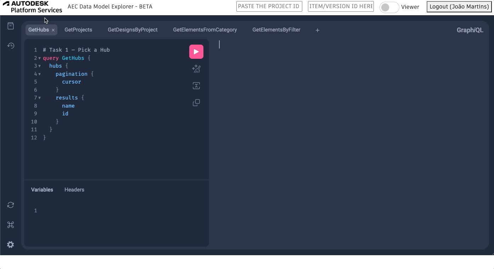

# Explorer and First Queries

Now that you're in a good shape to use the AEC Data Model API, we can start experimenting with the queries and the explorer to get more confortable with this new service. In this section, we'll introduce you to the interface that will help you explore your design data in a simple way, focusing in the API itself. As said before, we don't want to worry about frameworks, coding and cloud providers at this point. We can keep it simple using the [explorer](https://aecdatamodel-explorer.autodesk.io).

The UI of the explorer is intended to be simple and intuitive. We'll use it mostly to perform our queries by passing the payload and checking the response, just like in the image below:

> The explorer is based in the [graphiql](https://github.com/graphql/graphiql) project! If you want additional details, feel free to check that out! ;)

It also comes with multiple functionalities to check history of queries, formatting queries, configuring themes and shortcuts, and a button to display documentation of the API. This last option is the first one we'll check, as it provides us access to our APIs schema. This will be our entry point. We'll start our journey getting familiar with the AEC Data Model API schema.

## AEC Data Model Schema

As described at [graphql.org](https://graphql.org/learn/schema/):

> "Every GraphQL service defines a set of types which completely describe the set of possible data you can query on that service. Then, when queries come in, they are validated and executed against that schema."

Our API has a schema that's suitable to address the common data from AEC industry. It's composed by the 5 constructs described below:

- **Design**: A Design is a part of an AEC project that contains elements. Note that “Model” is sometimes used interchangeably with “Design”.
- **Elements**: An Element is a building block of AEC design data. It represents an individual piece of an AEC design such as a wall, window, or door without enforcing a rigid definition. The absence of a rigid definition allows the Element to be flexible to adapt to the different requirements of an AEC design, now and in the future. The data contained in an Element gives it context by using Classification, Property, and Property Definition.
- **Reference Property**: A reference property describes the relationship between elements.
- **Property**: A Property is a well-defined granular piece of data that describes the Element. For example: Revit parameters and their values like area, volume, length, etc.
- **Property Definition**: A Property Definition provides detailed information about a Property. It contains metadata that gives context to the Property. For example: Unit, type, etc.

Now lets use the explorer to view our schema.

Log in with your Autodesk account, then click in the Docs button and scroll down to access the queries available in AEC Data Model's schema.

The first query we used in previous step returned to us a list of hubs.According to this docs we could, for instance, use a filter to retrieve only the hubs matching certain conditions. Exploring the schema gives us a better idea about the capabilities of the API.

Now that we know the importance of the schema and know how to view it using the explorer, we can continue with the subsequent queries.

## First Queries

We suppose that you're familiar with how the data is organized in context of ACC hubs:

[Next Step - Adaptando aos seus dados]({{ site.baseurl }}/adapting/home/){: .btn}
