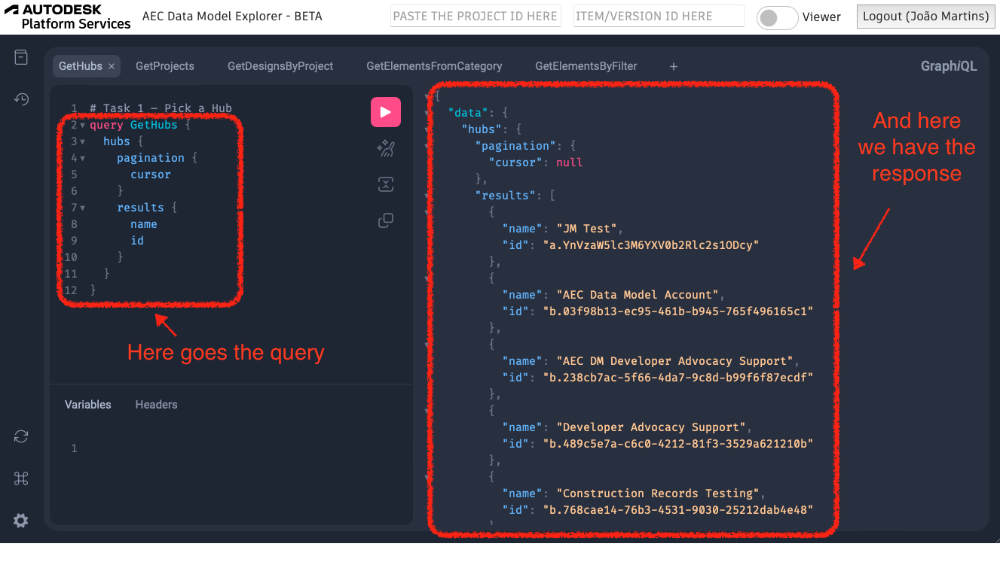

# Explorer and First Queries

Now that you're in a good shape to use the AEC Data Model API, we can start experimenting with the queries and the explorer to get more confortable with this new service. In this section, we'll introduce you to the interface that will help you explore your design data in a simple way, focusing in the API itself. As said before, we don't want to worry about frameworks, coding and cloud providers at this point. We can keep it simple using the [explorer](https://aecdatamodel-explorer.autodesk.io).

The UI of the explorer is intended to be simple and intuitive. We'll use it mostly to perform our queries

> The explorer is based in the [graphiql](https://github.com/graphql/graphiql) project! If you want additional details, feel free to check that out! ;)

It can also be used to get familiar with the schema of the AEC Data Model API, and this is where we begin our journey: with the Data Schema.

## AEC Data Model Schema

As described at [graphql.org](https://graphql.org/learn/schema/):

> "Every GraphQL service defines a set of types which completely describe the set of possible data you can query on that service. Then, when queries come in, they are validated and executed against that schema."

Our API has a schema that's suitable to address the common data from AEC industry.

You can check it below:

[Next Step - Adaptando aos seus dados]({{ site.baseurl }}/adapting/home/){: .btn}
